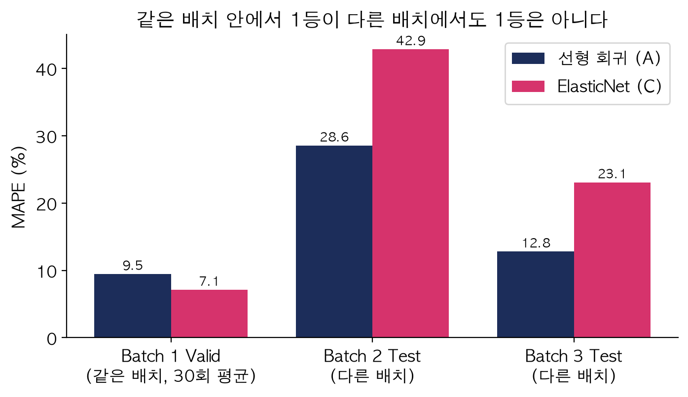

# ESS 배터리 수명 예측

ESS 운영사가 배터리 교체 시점과 예산을 미리 계획할 수 있도록, **용량이 줄기 전인 초기 100사이클 데이터만으로 배터리 전체 수명(cycle_life)을 예측**한다.
성능 숫자보다 **왜 이렇게 골랐고, 결과가 왜 그렇게 나왔는지**를 남기려고 했다. 결정별 이유와 대안은 [`DECISIONS.md`](DECISIONS.md)에 있다.

## 프로젝트 개요
- 데이터셋 : MIT-Stanford Battery Dataset (Severson et al., Nature Energy 2019), LFP/흑연 셀, 공칭 1.1Ah
- 학습 데이터 : Batch 1 (2017-05-12) 정상 36셀
- 평가 데이터 : Batch 2 (2018-02-20) 39셀 / 추가 평가 Batch 3 (2018-04-12) 44셀
- 태스크 : **Regression** (Cycle Life 예측, 수명 끝 = 0.88Ah)
- DAY 1 모델 전략 보고서 : [`reports/DS-MINI-Design-울산_2반-이진서.pdf`](reports/DS-MINI-Design-울산_2반-이진서.pdf)

## 파일 구조
```
├── data/README.md                    # 원본 .mat 받는 방법 (저장소 미포함)
├── notebooks/
│   ├── 01_EDA.ipynb                  # DAY 1 EDA
│   ├── 02_feature_engineering.ipynb  # 피처 세트 A~D, 배치별 측정 시작점 확인
│   └── 03_modeling.ipynb             # 튜닝·선택·테스트·오류 분석·논문 비교·운영 기준
├── src/
│   ├── load_data.py                  # 전처리 (.mat 읽기, 셀 상태 분류)
│   ├── features.py                   # 피처 계산, 피처 세트
│   └── train.py                      # 분할 → 튜닝 → 선택 → 테스트 → 저장
├── results/                          # 성능표, 예측값, 그림, 학습 전 예상(day2_hypotheses.md)
└── DECISIONS.md                      # 결정 기록 22건
```

## 환경 설정
```bash
git clone <이 저장소 주소>
pip install -r requirements.txt
python src/train.py   # data/README.md대로 .mat을 넣은 뒤 실행 (처음 1회 캐시 생성)
```

## EDA
- **Cycle Life 분포** : Batch 1 534~1,074 / Batch 2 392~1,186 (72%가 500 미만) / Batch 3 541~1,935
  - 핵심 발견 : 같은 충전 정책도 Batch 1 744 vs Batch 2 400사이클. 충전 조건보다 **배치 자체의 차이**가 크다.
- **열화 곡선 분석** : 100사이클까지 용량 변화 +0.2%, 무릎점은 수명의 약 70% 지점
  - 핵심 발견 : 100사이클 시점엔 모두 멀쩡해 보인다. 용량 값으로는 구분할 수 없다.
- **ΔQ(V) 곡선 분석** : 같은 셀의 100번째 − 10번째 방전 곡선. 단수명일수록 깊게 휜다.
  - 핵심 발견 : log 분산–수명 상관 −0.84 / −0.92 / −0.76. **세 배치 모두에서 방향이 같은 유일한 신호**
- **충전 속도(C-rate)와 수명의 관계**
  - 핵심 발견 : 빨리 충전할수록, 같은 시간이어도 전류를 한 구간에 몰수록 단수명
- **추가 확인** : Batch 1 관계식을 Batch 2 기존 방식 30셀에 쓰면 수명을 약 32% 길게 잡는다 → **DAY 2 과대예측을 미리 예고**

## Modeling

### 피처 엔지니어링 전략
학습과 시험이 **다른 배치**라서, 피처 기준을 "상관이 큰가"가 아니라 **"배치가 바뀌어도 방향이 같은가"**로 잡았다.

| 세트 | 피처 | 고른 이유 |
|---|---|---|
| **A** | log10 Var(ΔQ) | 세 배치 모두 방향 동일. 같은 셀끼리 빼서 배치마다 다른 시작 용량이 지워진다 |
| B | A + 평균·최대 C-rate | 운영사가 바꿀 수 있는 변수. 넣으면 좋아지는지 보고 싶었다 |
| C | ΔQ 통계 + C-rate + 현장 피처 (12개) | 모델이 스스로 고르게 하면 어떨까 |
| D | 현장(BMS) 피처만 8개 | 진단 방전 없이 평소 기록만으로 어디까지 되나 |

> **고민한 것 — 노션의 "Qdlin 시작점이 배치마다 다르다"는 경고**
> DAY 1에는 "같은 셀끼리 빼니 괜찮을 것"이라고만 썼다. 확인해 보니 초기 용량의 배치 차이가 표준편차의 3.5배였다. ΔQ에서는 사라지지만 현장 피처(C·D)에는 그대로 남고, 이게 나중에 결과를 갈랐다.

### 모델 선택 및 근거
- 후보 모델 : 평균 예측(기준선) / **선형 회귀**(A) / ElasticNet(B·C·D, 피처 중복 규제) / 랜덤포레스트·그래디언트부스팅(A·B·C, 비선형 확인)
- 학습 전략 : Batch 1을 **충전 정책 단위로** Train 28 / Valid 8셀로 분할. Train 안에서 GridSearchCV + 정책 단위 GroupKFold(5겹)로 튜닝. 타깃은 log10(수명), MAPE는 사이클로 되돌려 계산
- **최종 모델 : 선형 회귀, 피처 1개** → `log10(수명) = 1.762 − 0.297 × log10 Var(ΔQ)` (ΔQ 분산이 10배면 수명 약 절반)
- 선택 이유 : Valid 1등(9.29%). 2등 ElasticNet(C) 9.47%와 0.2%p 차이였지만 CV–Valid 차이가 0.27 대 3.47%p로 훨씬 안정적

| Batch 1 안에서 비교 | Train CV | Valid |
|---|---|---|
| 평균 예측 | 14.3 | 22.5 |
| **선형 회귀 (A)** | **9.0** | **9.3** |
| ElasticNet (B / C / D) | 10.0 / 6.0 / 12.4 | 11.3 / 9.5 / 20.3 |
| 트리 2종 (A~C) | 9.1 ~ 10.2 | 10.3 ~ 12.6 |

**고려했지만 고르지 않은 것**

| 선택지 | 안 한 이유 |
|---|---|
| 분류 (5사이클, 550 기준) | 운영사에는 남은 사이클 수가 필요. Batch 2는 72%가 500 미만이라 쏠림 |
| ElasticNet (C) | Batch 1 안에서는 좋았지만 불안정. 배치마다 출발점이 다른 현장 피처가 섞임 |
| 트리 모델 | 비선형 이득 없음, 학습 최대 수명(1,074)을 넘는 값을 못 냄 |
| 50사이클 예측 | 빨리 알지만 오차 증가(Batch 2 39%, Batch 3 16%) → 1차 경보용으로만 |
| 딥러닝 | 학습 셀 36개로는 외워 버림. 교체 결정에는 이유 설명이 필요 |
| 테스트 결과 보고 모델 바꾸기 | 테스트가 더 이상 시험이 아니게 됨. 테스트 후 실험은 '참고'로 분리 |

> **고민한 것 — 왜 정책 단위로 나눴나**
> 같은 정책 셀이 2개씩(쌍둥이) 있어서, 셀 단위로 나누면 한쪽은 학습·한쪽은 검증에 들어가 답을 미리 본다. 노션은 그래서 Hold-out을 쓰라고 했고, 나는 튜닝용 CV도 정책 단위로 나눠 같은 누수를 막았다.
>
> **고민한 것 — Valid 8셀을 믿을 수 있나**
> 분할을 30번 바꿔 보니 같은 모델의 Valid가 ±2%p 흔들렸다. 그래서 "1%p 안이면 동점, 다음은 안정성·단순함" 규칙으로 골랐다.

## 성능 결과

| 구분 | MAPE (%) | 비고 |
|---|---|---|
| Train (Batch 1 CV) | 9.03 | Train 28셀 |
| Valid (Batch 1 Hold-out) | 9.29 | 8셀 |
| Test (Batch 2) | **28.56** | Batch 1 전체로 재학습 후 1회 평가 |
| Gap (Train-Valid) | +0.27 | 과적합 거의 없음 |
| Gap (Valid-Test) | **+19.27** | 배치 간 일반화 저하 |
| Gap (Target-Test) | +19.46 | Target : 원논문 9.1% |
| Test (Batch 3) | 12.81 | 44셀 (논문과 같은 40셀 기준 11.75) |
| Gap (Batch2-Batch3) | +15.75 | Batch 2가 더 어려운 시험 |
| Gap (Target-Test, Batch 3) | +3.71 | |

### Gap은 왜 생겼나
- **Valid-Test** : 오차가 *Batch 2 기존 방식 30셀*에 몰렸고, **30셀 모두 길게 예측**했다(중앙값 +32%, 153사이클). DAY 1에서 미리 적어 둔 숫자와 같다. 같은 ΔQ에서도 이 그룹은 짧게 산다 → 피처로 설명되지 않는 배치(로트·실험 시기) 차이로 본다.
- **Target-Test** : 논문 원문을 다시 읽어 보니 **시험 조건이 달랐다.**

  | | 학습 | 1차 테스트 | 2차 테스트 (Batch 3) |
  |---|---|---|---|
  | 논문 variance 모델 (ΔQ 1개) | 14.1 | 14.7 (Batch 1·2를 섞어 반씩 나눔) | 11.4 |
  | **우리 선형 회귀 (ΔQ 1개)** | 8.5 | **28.6** (Batch 2, 학습·튜닝에 안 씀) | **11.75** (같은 40셀) |

  - 논문 모델은 Batch 2 셀로도 학습해 그 성질을 이미 배웠다. 우리 모델은 Batch 2를 학습·튜닝에 쓰지 않았다(과제 지정 최종 평가 데이터). 단 DAY 1 EDA에서 분포는 봤으므로 완전한 블라인드는 아니다.
  - 조건이 비슷한 Batch 3는 논문과 0.35%p 차이 → **모델은 논문을 재현했고, Batch 2 Gap은 시험 조건에서 왔다.** 9.1%는 다중 피처 최고 모델이라 숫자만 비교하면 오해하기 쉽다.

## 오류 분석
- **가장 크게 틀린 셀의 공통점** : 오차 상위 12셀 중 9셀이 Batch 2 기존 방식, 11셀이 과대예측. 수명은 392~514로 좁은데 ΔQ는 넓게 퍼져 ΔQ로 구분이 안 된다. 반대로 Batch 3의 2,000사이클급 셀은 짧게 예측했다(학습에 1,100 이상 셀이 없음).
- **원인 가설 및 개선 방향**
  - 피처를 더 넣으면? → 어떤 후보도 Batch 2 기존 방식을 못 맞혔다(32~85%). 피처 문제가 아니다.
  - 새 배치 셀 5개로 기준을 보정하면? → Batch 2 오차 28.6% → 약 11% *(테스트 정답 일부를 쓴 참고 실험)*

### 가장 크게 배운 것 — 연습 1등이 실전 1등은 아니었다


- Batch 1 안에서는 **ElasticNet(C)이 분할 30번 중 26번 1등**이었는데, 테스트에서는 Batch 2 42.9%, Batch 3 23.1%로 선형보다 훨씬 나빴다. 배치마다 출발점이 다른 초기 용량·충전 시간을 함께 배웠기 때문이다.
- 같은 배치 안 검증으로는 "배치가 바뀌는 상황"을 시험할 수 없다. 내 최종 선택이 맞은 데엔 운도 있었다.
- **"배치가 바뀌어도 방향이 같은 피처만 믿는다"는 EDA 기준이 검증 점수보다 중요했다.**

### 시작 전 예상과 비교 ([`day2_hypotheses.md`](results/day2_hypotheses.md), 학습 전에 작성)

| 예상 | 결과 |
|---|---|
| Batch 2에서 길게 예측할 것 | ○ 기존 방식 30셀 전부 과대예측 |
| 충전 정책을 더해도 좋아지지 않을 것 | ○ Batch 3 12.8 → 12.1, Batch 2 28.6 → 29.6 |
| 현장 피처만으로는 확실히 나쁠 것 | ○ Batch 2 70.9% (평균 예측보다 나쁨) |
| 트리는 장수명 셀을 짧게 예측할 것 | ○ 트리 예측 최대 약 1,000 |
| Batch 3가 Batch 2보다 잘 맞을 것 (노션 안내와 반대) | ○ 12.8% vs 28.6% |
| (예상 못 함) | 같은 배치 안 1등 모델이 다른 배치에서는 하위권 |

## ESS 도메인 해석
- **이 모델을 실제 BESS에 적용한다면 어떤 의사결정에 활용 가능한가?**
  - **교체 예산·부품 계획** : 설치 약 3개월(100사이클) 시점에 셀별 수명 예측. 같은 로트 안 오차 약 9~13%로 분기 단위 계획에 쓸 수 있다.
  - **위험 셀 우선 점검** : "ΔQ 분산 10배 → 수명 절반"처럼 이유를 설명할 수 있다.
  - **보수적 교체 기준 (내 제안)** : 길게 보는 실수(정지 위험)가 짧게 보는 실수(낭비)보다 위험하므로 **예측의 약 90% 시점에 교체를 준비**한다. 90%는 Batch 1 오차의 하위 10%로 정했다(테스트 미사용).

    | | 길게 본 셀 | 교체 지연 (중앙값) | 조기 교체 낭비 ($/MWh) |
    |---|---|---|---|
    | Batch 3, 예측 그대로 | 57% | 76일 | 1,700 ~ 4,500 |
    | Batch 3, 예측의 90% | **27%** | **42일** | 3,300 ~ 8,800 |
    | Batch 2, 예측의 90% | 85% | 92일 | – |
    | Batch 2, 로트 보정(5셀) + 90% | **23%** | – | (MAPE 12.7%) |

    - 같은 로트에서는 MWh당 약 $1,600~4,400를 더 쓰고 위험한 실수를 절반 이하로 줄인다. 정지 한 번의 손실이 이보다 크면 여유를 두는 게 맞다.
    - 새 로트는 배치 차이(약 −24%)가 여유보다 커서 부족하다 → **① 새 로트는 일부 셀을 실험실 가속 시험으로 먼저 보정 → ② 여유를 두고 교체 계획.** 이 절차가 모델 성능을 1~2%p 올리는 것보다 운영 위험을 더 줄인다.
- **어떤 한계가 있으며, 실 배포를 위해 추가로 필요한 것은 무엇인가?**

  | 한계 | 필요한 것 |
  |---|---|
  | 실험실 고속충전 데이터. 실제 ESS는 몇 시간 충방전·부분 방전 | 실제 BMS 데이터로 재검증 |
  | ΔQ는 완전 방전 곡선이 필요. 현장 피처만으로는 기준선보다 나쁨 | 정기 진단 방전 (정지 비용과 비교) |
  | 새 로트에 그대로 쓰면 크게 틀림 | 로트별 샘플 보정 절차 (실험실·현장 조건 차이는 재확인) |
  | 학습 셀 36개, 수명 1,074 이하만 학습 | 장수명 셀 확보, 사용 중인 배터리까지 쓰는 생존 분석 |
  | 여유 10%는 Batch 1 오차로만 정함 | 현장 데이터로 여유 비율·예측 범위 재설정 |

## 회고 — 하면서 생각한 것
- 처음엔 "논문에 답이 있는데 내가 왜 분석하지?"라고 생각했다. 해 보니 논문 숫자(9.1%)와 내 숫자(28.6%)가 왜 다른지 찾는 과정이 분석이었다. 원문을 다시 읽고서야 논문은 Batch 1·2를 섞어 학습했다는 걸 알았다. 숫자만 보고 "3배 나쁘다"고 했다면 틀린 결론이었다.
- Batch 2 결과를 처음 봤을 땐 실패한 줄 알았다. 그런데 어제 EDA에서 적어 둔 "+32%"와 똑같았다. 결과에 이유를 갖다 붙인 게 아니라 미리 예상한 것이라, EDA를 왜 하는지 처음 실감했다.
- 가장 의외는 ElasticNet이었다. 검증에선 거의 매번 1등이었는데 다른 배치에선 무너졌다. 내 선택이 맞은 데엔 운도 있었다. 다음엔 점수보다 "이 피처가 다른 조건에서도 같은 의미인가"를 먼저 따지겠다.
- "셀 5개로 보정하자"고 해 놓고, 그 5개는 수명 끝까지 어디서 돌리냐는 의문이 들었다. 현장에서 기다릴 수 없으니 실험실 가속 시험이 필요하고, 그만큼 현장과 조건이 달라지는 한계도 생긴다.
- 운영사 직원이라면 바로 쓰자고 하진 않겠다. "로트 보정 + 90% 시점 교체 준비"를 조건으로 일부 설비에서 시범 운영해 보자고 하겠다. 같은 로트에서 오차 10% 안팎이면 예산 계획에는 충분히 도움이 된다.
- 다시 한다면 장수명 셀(1,100사이클 이상)이 학습에 없는 문제와, 아직 수명이 끝나지 않은 배터리를 버린 부분을 먼저 다루고 싶다. 실제 현장 배터리는 대부분 아직 사용 중이다.

## 참고문헌
- Severson et al. (2019). Data-driven prediction of battery cycle life before capacity degradation. *Nature Energy*, 4, 383–391.

## 팀 구성
- 이진서 (울산 2반, 개인) : EDA, 피처 엔지니어링, 모델 개발, 성능 평가(Batch 2·3), 오류 분석, 도메인 해석
